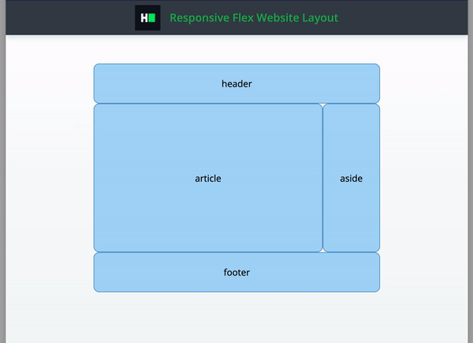

# CSS: Responsive flex website layout

Complete a partially completed application. Complete the application shown below using CSS `flex` rules in order to pass
all the unit tests.

## Environment

- Node Version: ^12.18.3
- Default Port: 8000

## Application Demo:



## Application description

Complete a website layout application with the following UI:

Your layout contains following components:

- header
- main
    - article
    - aside
- footer

Position all components the way described below:

- Container with "layout" classname should use `flex` display
- Height of header should be 70px
- Height of footer should be 70px
- For the desktop layout (screen width ≥768px):
  - Width of aside should be 100px
  - Article should be taking the remaining space
- For the mobile layout (screen width <768px):
  - Aside should be positioned right after footer with width 100% and height of 70px
  - Content be positioned right after aside and take the remaining space.

All the markup for the question has been added. As a candidate, you have to complete the CSS file to implement the
above-stated features.

## Project Specifications

**Read Only Files**

- `test/*`
- `src/index.js`
- `src/index.html`
- `src/css/readonly.css`
- `app.js`

**Commands**

- run:

```bash
npm start
```

- install:

```bash
npm install
```

- test:

```bash
npm test
```
